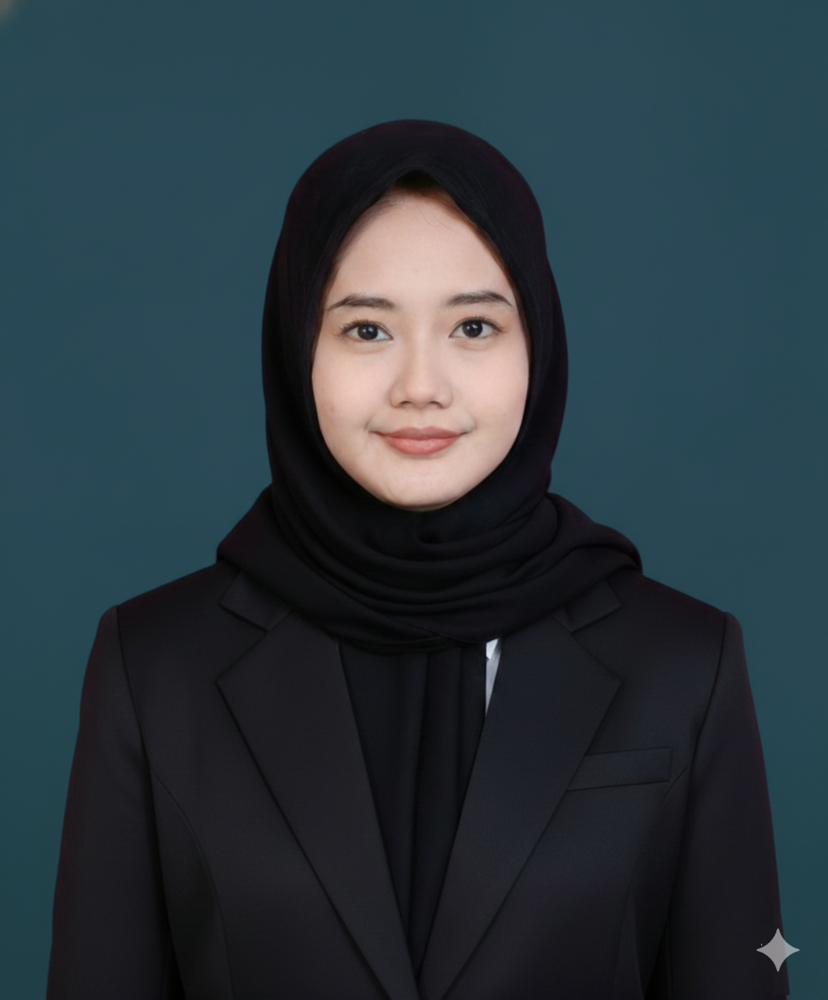

# Portfolio Website - Isnaya Nurfadilla

Dokumentasi lengkap tentang website portfolio ini.

---

## 📋 Daftar Isi

1. [Overview](#overview)
2. [Teknologi yang Digunakan](#teknologi-yang-digunakan)
3. [Struktur Proyek](#struktur-proyek)
4. [Fitur yang Diimplementasikan](#fitur-yang-diimplementasikan)
5. [Customization Guide](#customization-guide)
6. [Cara Menjalankan](#cara-menjalankan)

---

## Overview

Portfolio website personal untuk menampilkan profile, skills, dan project-project yang telah dikerjakan. Website ini menggunakan desain modern dengan tema dark mode, efek glassmorphism, dan animasi 3D yang menarik.

---

## Teknologi yang Digunakan

### 1. **HTML5**
- **Versi**: HTML5
- **Fungsi**: Struktur dasar website
- **Keunggulan**: Semantic markup, SEO-friendly, cross-browser compatible
- **Penggunaan**: Section untuk hero, about, skills, projects, contact, footer

### 2. **CSS3**
- **Fungsi**: Styling dan animasi
- **Keunggulan**: Flexbox & Grid layout, CSS animations, Custom properties (variables)
- **Fitur CSS yang digunakan**:
  - **CSS Grid**: Layout skills dan projects cards
  - **CSS Flexbox**: Navbar, hero section, centering elements
  - **CSS Variables**: Untuk konsistensi warna (`:root`)
  - **CSS Animations**: Keyframes untuk efek 3D rotate
  - **CSS Transitions**: Hover effects smooth
  - **Backdrop Filter**: Efek glass/blur
  - **Media Queries**: Responsivitas mobile

### 3. **Google Fonts - Inter**
- **Link**: `https://fonts.googleapis.com/css2?family=Inter:wght@300;400;500;600;700;800&display=swap`
- **Fungsi**: Tipografi utama website
- **Mengapa Inter**: Clean, modern, readable, banyak variant weight

### 4. **SVG Icons**
- **Sumber**: Inline SVG (tidak menggunakan library eksternal)
- **Icon yang digunakan**: GitHub, LinkedIn, Email
- **Keunggulan**: Load cepat, scalable, bisa styling dengan CSS

### 5. **Placeholder Image**
- **Layanan**: via.placeholder.com
- **Fungsi**: Fallback image jika foto profil tidak tersedia
- **Format**: `https://via.placeholder.com/400x400/0f2027/00f5ff?text=A`

---

## Struktur Proyek

```
isnaya/
├── index.html          # Halaman utama portfolio
├── style.css           # Styling dan animasi
├── isnaya.png          # Foto profil (opsional)
└── README.md           # Dokumentasi ini
```

---

## Fitur yang Diimplementasikan

### 1. **Navbar (Navigasi)**
- **Fitur**: 
  - Navigasi tetap di atas saat scroll (fixed position)
  - Efek blur/glass
  - Hover effect dengan underline animasi
- **Link**: About, Skills, Projects, Contact

### 2. **Hero Section**
- **Elemen**:
  - Sapaan dan nama
  - Tagline/jobs
  - Bio singkat
  - Tombol CTA (View Work & Contact)
  - Social media links (GitHub, LinkedIn, Email)
  - **Foto Profil dengan Animasi 3D**
- **Animasi 3D**:
  - `rotateY(360deg)` - Putaran horizontal 3D
  - `rotateX(10deg)` - Sedikit tilt untuk efek 3D
  - Gradient animasi
  - Glow effect dengan box-shadow

### 3. **About Section**
- **Layout**: Split (foto + text)
- **Fitur**:
  - Foto profil
  - Deskripsi diri
  - Highlight cards dengan icon:
    - 🏦 Sistem Koperasi
    - ☁️ SaaS Development
    - 🤖 AI Integration

### 4. **Skills Section**
- **Layout**: Grid responsive
- **Per Skill Card**:
  - Icon (emoji)
  - Nama skill
  - Deskripsi singkat
  - **Progress bar** menunjukkan level keahlian
- **Skills yang ditampilkan**:
  - Laravel (90%)
  - Filament (85%)
  - React (75%)
  - Tailwind (80%)
  - AI Integration (70%)
  - Database Design (85%)

### 5. **Projects Section**
- **Layout**: Grid responsive
- **Per Project Card**:
  - Image placeholder dengan icon
  - Tags (Laravel, SaaS, AI, dll)
  - Judul project
  - Deskripsi
  - Tech stack used
  - Link "Lihat Detail"
- **Project yang ditampilkan**:
  - 🏦 **Koperasi Digital** - Sistem manajemen keuangan
  - ☁️ **Lisensi SaaS** - Platform lisensi multi-tenant
  - 🤖 **AI Coding Assistant** - AI untuk coding

### 6. **Contact Section**
- **Layout**: Split (info + form)
- **Contact Info**:
  - Email
  - Lokasi
  - Availability status
- **Contact Form**:
  - Input: Nama, Email, Pesan
  - Styled form fields
  - Submit button dengan hover effect

### 7. **Footer**
- **Elemen**:
  - Logo
  - Tagline
  - Social links
  - Copyright

---

## Customization Guide

### 🔧 Mengganti Foto Profil

```html
<!-- Di index.html, cari: -->

<!-- Ganti dengan nama file Anda -->

```

**Rekomendasi**: 
- Format: JPG atau PNG
- Ukuran: Minimal 300x300 px
- Rasio: Boleh square atau portrait

### 🎨 Mengganti Warna Theme

Di `style.css`, bagian `:root`:

```css
:root {
    --primary-color: #00f5ff;    /* Warna utama (cyan) */
    --secondary-color: #7f00ff; /* Warna sekunder (purple) */
    --bg-dark: #0f2027;          /* Background utama */
    --bg-darker: #0a1520;       /* Background gelap */
    /* ... */
}
```

### 📝 Mengedit Konten

**Mengubah About:**
```html
<section id="about">
    <p>Deskripsi baru Anda...</p>
    <!-- Update highlight items -->
</section>
```

**Menambah Skill:**
```html
<div class="skill-card">
    <div class="skill-icon">🔧</div>
    <h3>Nama Skill</h3>
    <p>Deskripsi skill</p>
    <div class="skill-level"><span style="width: 80%"></span></div>
</div>
```

**Menambah Project:**
```html
<div class="project-card">
    <div class="project-image">
        <div class="project-placeholder">📦</div>
    </div>
    <div class="project-info">
        <!-- Isi dengan tag, judul, deskripsi, dll -->
    </div>
</div>
```

### 📱 Mengedit Social Links

```html
<!-- Di hero section dan footer -->
<a href="https://github.com/username-anda" class="social-icon">
    <!-- SVG icon -->
</a>
```

### ⏱️ Mengatur Kecepatan Animasi

```css
/* Profile ring animation */
.profile-ring {
    animation: 
        gradient-shift 3s ease infinite,  /* Ubah 3s */
        rotate3d 6s linear infinite;       /* Ubah 6s */
}
```

---

## Cara Menjalankan

### Metode 1: Langsung Buka File

1. Buka folder `isnaya`
2. Klik dua kali `index.html`
3. Website akan terbuka di browser default

### Metode 2: Local Server (VS Code)

1. Install extension **"Live Server"** di VS Code
2. Klik kanan `index.html`
3. Pilih **"Open with Live Server"**

### Metode 3: Python HTTP Server

```bash
# Terminal di folder isnaya
python -m http.server 8000
# Buka http://localhost:8000
```

---

## Browser Support

- Chrome 60+
- Firefox 55+
- Safari 11+
- Edge 79+

---

## Performansi

- **Tanpa framework** - Load sangat cepat
- **SVG inline** - Tidak perlu HTTP request tambahan
- **Placeholder** - Lazy load via onerror
- **CSS-only animations** - GPU accelerated

---

## Lisensi

Copyright © 2026 Isnaya Nurfadilla. All Rights Reserved.

---

## Kontak

- **Email**: aldy@email.com
- **GitHub**: github.com/username
- **LinkedIn**: linkedin.com/in/username
